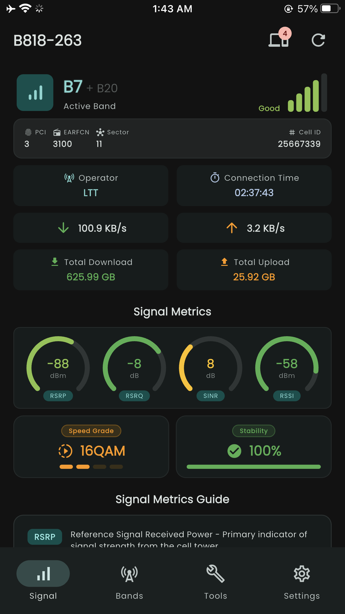
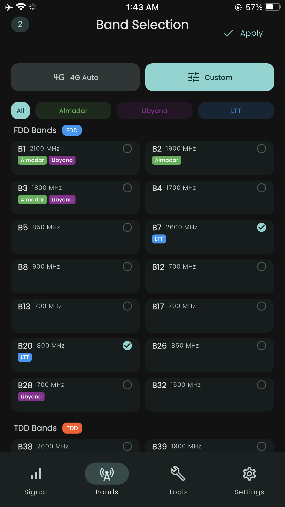

# Taraddud for Huawei Routers CPE

**تطبيق التحكم في راوتر Huawei**

---

## 📖 عن التطبيق

تطبيق بسيط للتحكم في راوترات Huawei CPE (4G/5G) من هاتفك الأندرويد.

---

## ✨ المميزات

### 📊 معلومات الشبكة
- عرض قوة الإشارة (RSRP, RSRQ, SINR)
- معرفة نوع الشبكة والنطاق الحالي
- مراقبة سرعة الإنترنت
- عرض البيانات المستهلكة

### 👥 الأجهزة المتصلة
- عرض قائمة الأجهزة المتصلة بالراوتر
- معرفة اسم الجهاز وعنوان IP

### 📡 إدارة النطاق
- قفل الراوتر على نطاق ترددي محدد
- فتح جميع النطاقات
- معرفة النطاقات المدعومة

### ⚙️ إعدادات
- دعم اللغة العربية والإنجليزية
- الوضع الليلي والفاتح

---

## 📱 لقطات الشاشة

| لوحة التحكم | الأجهزة المتصلة | إدارة النطاق |
|:---:|:---:|:---:|
|  |  |  |

---

## 📥 التحميل

**النسخة**: 1.0.0 Beta  
**الحجم**: ~55 MB  

### [⬇️ تحميل APK](https://github.com/3sluz/taraddud/releases/latest/download/Taraddud-v1.0.0-beta.apk)

---

## 🚀 التثبيت

1. حمّل ملف APK
2. فعّل "التثبيت من مصادر غير معروفة" في إعدادات الأمان
3. افتح الملف واضغط "تثبيت"
4. اتصل بشبكة WiFi الخاصة بالراوتر
5. افتح التطبيق وسجّل الدخول

---

## ❓ أسئلة شائعة

**هل التطبيق مجاني؟**  
نعم، مجاني بالكامل.

**هل يعمل مع جميع راوترات Huawei؟**  
يعمل مع راوترات Huawei CPE (4G/5G).

**هل يحتاج صلاحيات Root؟**  
لا، يعمل على جميع الأجهزة بدون Root.

---

## 👨‍💻 المطور

تم التطوير بواسطة **3sluz**

💬 Telegram: [@M3sluz](https://t.me/M3sluz)

---

## 🙏 شكر

شكراً لجميع المختبرين في النسخة البيتا

---

**صُنع بـ ❤️ في ليبيا 🇱🇾**

إذا أعجبك التطبيق، أعطه ⭐ على GitHub!

